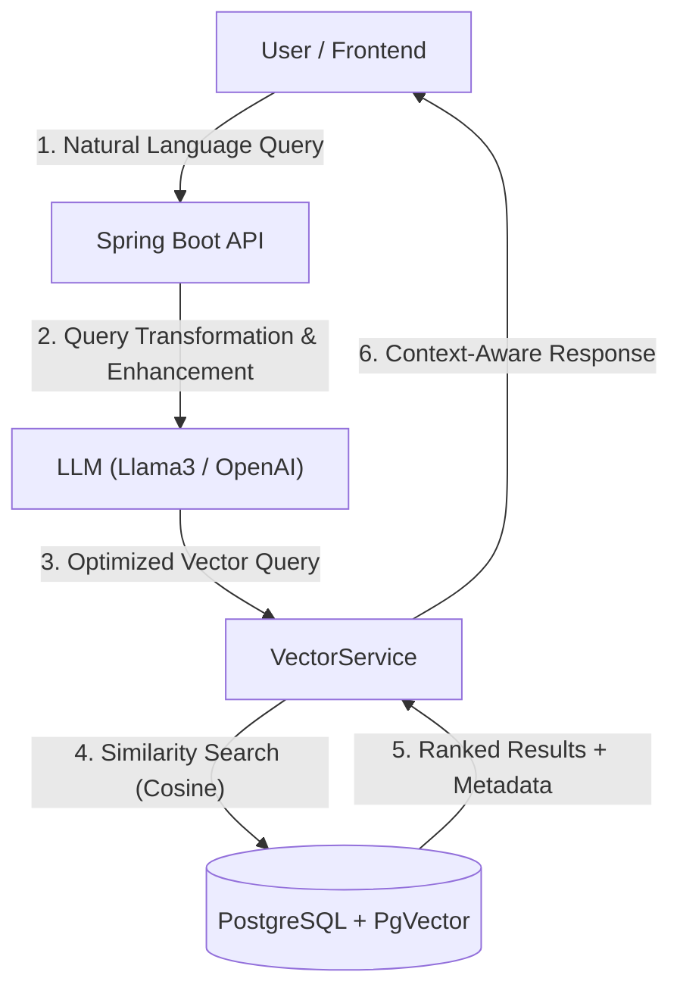

# 🚘 Gallerist API - Next Gen AI-Powered Vehicle Management System

   

**Gallerist API** is a high-performance and scalable Backend service that combines traditional vehicle management systems with **GenAI (Generative AI)** and **Vector Search** technologies.

It is built upon a **RAG (Retrieval-Augmented Generation)** architecture, allowing users to perform vehicle searches using **Natural Language**.

---

## 🏗 System Architecture & RAG Pipeline

This project features a modern architecture where data is stored and queried not just textually, but semantically.



---

## 🔥 Key Features (The "Elite" Stuff)

### 🧠 AI-Driven Semantic Search
When a user says *"Cheap family car"*, the system converts this into mathematical vectors and matches it with vehicles in the database that are *"Low price, spacious trunk, SUV/Sedan"*. It performs **meaning-based** search, not keyword-based.

### 🤖 Smart Query Optimization
User inputs are not processed in their raw form; they are first analyzed by the LLM. Currency conversion (e.g., USD -> TL) is performed, and **Intent Analysis** is conducted to optimize the database query.

### 🛡️ Enterprise-Grade Security
* **Stateless JWT Authentication:** Token validation on every request.
* **Role-Based Access Control (RBAC):** Isolated authorization for Admins, Dealers, and Customers.
* **BCrypt Hashing:** Passwords are never stored in plain text.

### ⚡ Performance & Scalability
* **Clean Architecture:** Controller -> Service -> Repository layered structure.
* **DTO Pattern:** Entities are not leaked externally; data security is ensured via Request/Response objects.
* **Global Exception Handling:** All errors are caught centrally (`@ControllerAdvice`) and returned to the client in a standardized JSON format.

---

## 🛠 Tech Stack

| Category | Technology |
|----------|------------|
| **Core** | Java 21, Spring Boot 3.5.x |
| **AI & Data** | Spring AI, PostgreSQL (pgvector), Ollama / OpenAI |
| **Security** | Spring Security, JWT (JJWT), BCrypt |
| **Documentation** | Swagger / OpenAPI 3.0 |
| **DevOps** | Docker & Docker Compose |
| **Build Tool** | Maven |

---

## 🚀 Getting Started

### Prerequisites
* Java 21 JDK
* Docker & Docker Compose
* Ollama (for Local LLM) or OpenAI API Key

### Installation

1. **Clone the repository**
   ```bash
   git clone [https://github.com/fatihsenguun/springbootgallerist.git](https://github.com/fatihsenguun/springbootgallerist.git)
   cd springbootgallerist
   ```

2. **Configure Environment**
   Edit the `src/main/resources/application.properties` file or define environment variables:
   ```properties
   spring.datasource.url=jdbc:postgresql://localhost:5432/gallerist
   spring.ai.openai.api-key=YOUR_API_KEY
   ```

3. **Run with Docker Compose (Recommended)**
   Automatically spins up the database and the PgVector extension.
   ```bash
   docker-compose up -d
   ```

4. **Start the Application**
   ```bash
   ./mvnw spring-boot:run
   ```

---

## 🔌 API Documentation

Once the system is running, you can test all endpoints via the Swagger UI:
👉 **URL:** `http://localhost:8080/swagger-ui.html`

---

## 💻 Frontend Integration & Screenshots

This backend service operates in integration with a modern React interface. The AI Search capabilities and Vehicle Details are best experienced through the UI.

👉 **Frontend Repository:** [Gallerist Frontend Repo Link Here](https://github.com/fatihsenguun/reactgallerist)

### 📸 Application Screenshots

| AI Powered Search | Vehicle Description (AI) | Dealer Dashboard |
|:---:|:---:|:---:|
|  <br> *Natural Language Query Interface* |  <br> *AI Generated Descriptions* |  <br> *Analytics & Management* |

